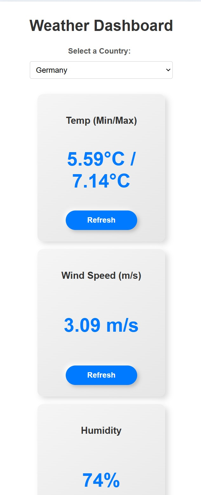

## Weather Dashboard

First, install the dependencies:

```bash
npm run install
```

Run the development server:

```bash
npm run dev
```

Open [http://localhost:3000](http://localhost:3000) with your browser to see the result.

## Features

Real-time weather data for any selected country.

- Widgets for:
   - Temperature (Min/Max)
   - Wind Speed
   - Humidity
   - Pressure
- Individual refresh buttons for each widget.
- Graceful error handling with dismissible error messages.
- Responsive design optimized for desktop and mobile.

## Technologies Used

- Framework: Next.js,
- Frontend: React, TypeScript,
- Styling: CSS Modules
- APIs:
  - OpenWeather API
  - RESTCountries API

## Preview




